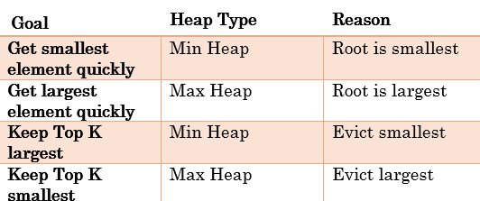

# Golang Datastructures — Quick

> ## Excerpt
> Golang Datastructures — Quick Cheatsheet This is a quick, Go-specific data structures cheatsheet designed for coding interviews.  It focuses on how to declare, use, and reason about common data …

---
[


](https://medium.com/@priyankabhat2468?source=post_page---byline--c6d26ce571ac---------------------------------------)

4 min read

Jan 1, 2026

This is a quick, Go-specific data structures cheatsheet designed for coding interviews.

It focuses on how to declare, use, and reason about common data structures in Go, along with their time complexity and typical use cases.

## ✅ 1. Slice (Dynamic Array)

```

var nums []int


nums := make([]int, 0, 4)
```

```

nums = []int{1, 2, 3}


nums = append(nums, 4)


len(nums)
cap(nums)
```

Slices are Go’s default dynamic array.

**⏱ Complexity**

-   Access by index: `O(1)`
-   Append: `O(1)` amortized
-   Insert/Delete with traversal: `O(n)`

**📌 Common Uses**

-   Arrays
-   Sliding windows
-   Two-pointer techniques
-   Stacks and queues (via slice)

## ✅ 2. Map (HashMap)

```
m := make(map[string]int)
```

```

m["a"] = 1


val, ok := m["a"]


delete(m, "a")
```

**⏱ Complexity**

-   Get / Set / Delete: `O(1)` average

**📌 Common Uses**

-   Fast lookup
-   Frequency counting
-   Deduplication
-   Caching / memoization

**⚠️ Notes**

-   Iteration order is random
-   Maps in Go are **not thread-safe** for concurrent writes, use a mutex for synchronization.

## ✅ 3. Stack (LIFO — using slice)

```
type Stack []int
```

```
func (s Stack) Push(x int) Stack {
    return append(s, x)
}

func (s Stack) Pop() (Stack, int) {
    n := len(s)
    if n == 0 {
      return s, -1
    }
    return s[:n-1], s[n-1]
}
```

## Usage

```
var s Stack
s = s.Push(10)
s = s.Push(20)

s, val := s.Pop() 
```

**⏱ Complexity**

-   Push: `O(1)` amortized
-   Pop: `O(1)`
-   Space: `O(n)`

**📌 Common Uses**

-   Parentheses validation
-   DFS traversal
-   Backtracking
-   Monotonic stack problems

**⚠️ Note**

-   Slices are reference-like (header copy)
-   Returning updated slice avoids pointer complexity

## ✅ 4. Queue (FIFO — using slice)

```
type Queue []int
```

```
func (q Queue) Enqueue(x int) Queue {
    return append(q, x)
}

func (q Queue) Dequeue() (Queue, int) {
    if len(q) == 0 { 
      return q, -1 
    }
    
    return q[1:], q[0]
}
```

## Usage

```
var q Queue
q = q.Enqueue(1)
q = q.Enqueue(2)

q, val := q.Dequeue() 
```

**⏱ Complexity**

-   Enqueue: `O(1)`
-   Dequeue: `O(n)` (slice shift)

**📌 Common Uses**

-   BFS traversal
-   Level-order tree traversal
-   Task scheduling (basic)

**⚠️ Note**

-   Slice-based queue is fine for interviews
-   For heavy dequeue operations → use ring buffer

## ✅ 5. Singly Linked List

```
type ListNode struct {
    Val  int
    Next *ListNode
}
```

Example create:

```
head := &ListNode{Val:1}
head.Next = &ListNode{Val:2}
```

## Insert at HEAD

```
func insertHead(head *ListNode, val int) *ListNode {
    return &ListNode{Val:val, Next:head}
}
```

**Usage:**

```
var head *ListNode
head = insertHead(head, 3)
head = insertHead(head, 2)
head = insertHead(head, 1)
```

## Insert at TAIL

```
func insertTail(head *ListNode, val int) *ListNode {
    if head == nil {
        return &ListNode{Val: val}
    }
    curr := head
    for curr.Next != nil {
        curr = curr.Next
    }
    curr.Next = &ListNode{Val: val}
    return head
}
```

**Usage:**

```
var head *ListNode
head = insertTail(head, 1)
head = insertTail(head, 2)
head = insertTail(head, 3)
```

**⏱ Complexity**

-   Insert/Delete with pointer: `O(1)`
-   Search: `O(n)`

**📌 Common Uses**

-   In-place list manipulation
-   Reversal problems
-   Cycle detection
-   LRU cache (with map)

## ✅ 6. Binary Tree

```
type TreeNode struct {
    Val   int
    Left  *TreeNode
    Right *TreeNode
}
```

Example:

```
root := &TreeNode{
    Val: 1,
    Left:  &TreeNode{Val:2},
    Right: &TreeNode{Val:3},
}
```

**⏱ Complexity**

-   Traversal: `O(n)`
-   Height (balanced): `O(log n)`

**📌 Common Uses**

-   Hierarchical data
-   DFS / BFS
-   Binary Search Trees
-   Heaps (conceptually)

## ✅ 7. Heap/Priority Queue

```
import "container/heap"

type IntHeap []int
```

```
func (h IntHeap) Len() int            { return len(h) }


func (h IntHeap) Less(i, j int) bool  { return h[i] < h[j] } 

func (h *IntHeap) Push(x interface{}) {
    *h = append(*h, x.(int))
}

func (h *IntHeap) Pop() interface{} {
    old := *h
    n := len(old)
    x := old[n-1]
    *h = old[:n-1]
    return x
}
```

Usage:

```
h := &IntHeap{3, 1, 4}
heap.Init(h)
heap.Push(h, 2)
min := heap.Pop(h).(int)
```

**⏱ Complexity**

-   Push / Pop an element: `O(log n)`
-   Peek: `O(1)`
-   Build a heap from a slice/array : `O(n)`

**📦 Packages**

```
import "container/heap"
```

**📌 Common Uses**

-   Top K problems
-   Scheduling
-   Merging sorted lists
-   Dijkstra (with graph)



**⚠️ Note**

-   A priority queue can be implemented using either a min-heap or max-heap depending on how priority is defined.

## ✅ 8. Graph (Adjacency List)

Adjacency list is preferred over matrix due to space efficiency.

```
graph := make(map[int][]int)
graph[1] = []int{2,3}
graph[2] = []int{4}
```

-   _Each key in the map → a_ **_vertex_**
-   _Each value slice →_ **_edges from that vertex_**

For weighted graph:

```
type Edge struct {
    To int
    Weight int
}
graph := make(map[int][]Edge)
```

**⏱ Complexity**

-   BFS / DFS: `O(V + E)` where V is vertices and E is edges.

**📌 Common Uses**

-   BFS / DFS
-   Shortest paths
-   Dependency graphs
-   Cycle detection

## 🧠 Final Notes

1.  **Slices + Maps solve most problems in Go**
    
    Stacks, queues, sliding windows, and sets are built using slices and maps.
2.  **Know slice behavior well**
    
    Length, capacity, reslicing, and append reallocation matter.
3.  **Choose data structures based on access patterns**

-   Fast lookup → map / set
-   Min / Max access → heap
-   Tree or graph traversals → stack / queue
-   Frequent insert/delete with pointer → linked list

4\. **Always state time complexity**

#golang

#codinginterview

#datastructures
